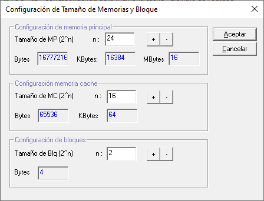
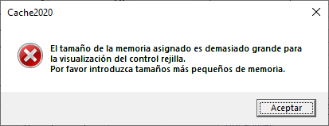
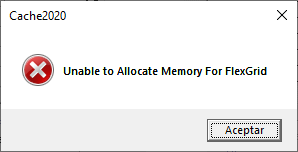

# Cache2020

> Es una actualización del programa `Cache2003` para que soporte más capacidades de Memoria Principal, Memoria de Cache y Tamaño de Bloques.

## Sobre Cache2003

> Cache2003 es un simulador de memoria caché. El software muestra la interacción que se produce entre la memoria principal y la memoria caché de un computador. El programa permite simular las diferentes políticas de emplazamiento y reemplazamiento de los bloques de instrucciones dentro de las memorias, proporcionando muchas opciones para observar el comportamiento y rendimiento de cada técnica.
El software fue realizado en el año 2003 (tal como lo dice su nombre) como proyecto final de la materia Arquitectura de Ordenadores de la Maestría en Ciencias de Computación de la Universidad de El Salvador (UES), con propósitos pedagógicos de laboratorio en dicha materia.

https://sourceforge.net/projects/cache2003/

## HECHO:

|#|Tarea|
|--:|:--|
|1|Migración a `Visual Studio 2019`|
|2|Política de emplazamiento `Directo` por omisión
|3|Pruebas de creación de `MP=16MB,MC=64KB,BLQ=4B`|
|4|Identificación de falla de `MSFlexGrid`|

## FALTA:

|#|Tarea|Avance|
|--:|:--|--:|
|1|Completar reemplazo de Control `MSFlexGrid` por `Ultimate Grid`|10%|
|2|Probar `Simular`|0%|
|3|Refactorizar código de `Cache2020`|0%|
|4|Separar en otro proyecto `Ultimate Grid`|0%|

## CAUSA:

- **Condición** dentro de programa
  
  

  

- **Problema** de MSFlexGrid

  